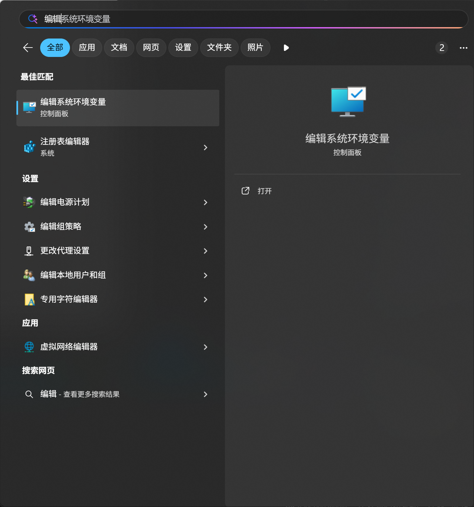
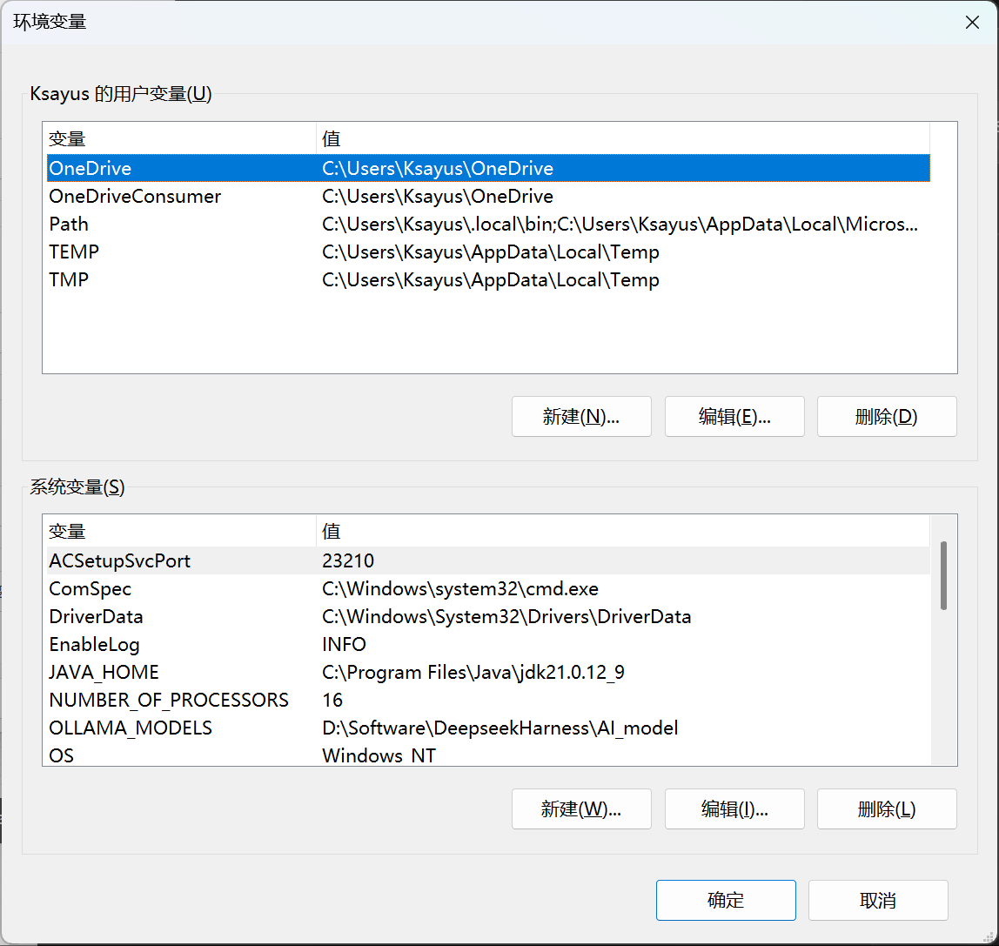
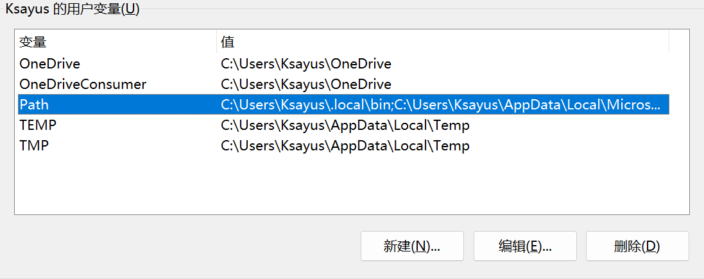
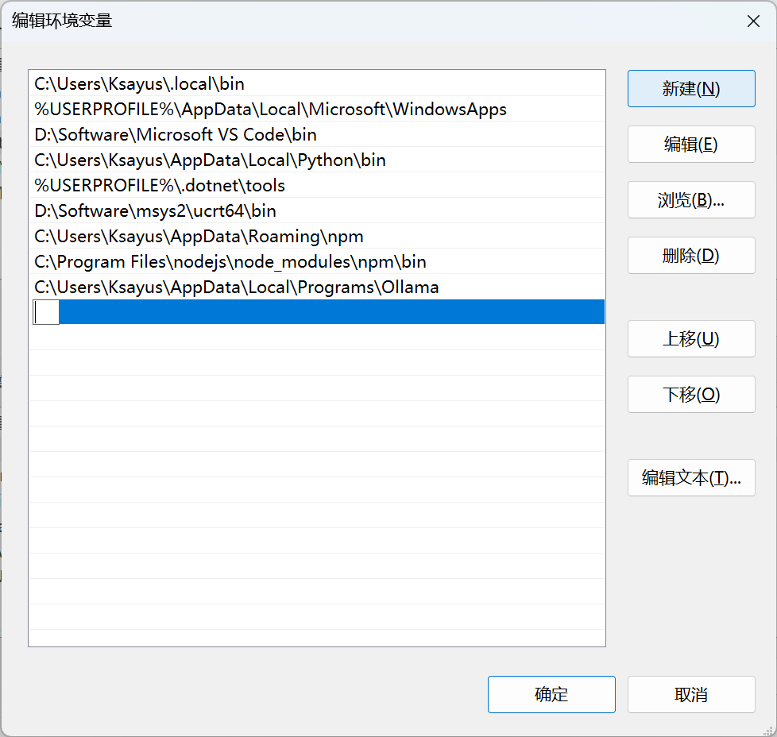
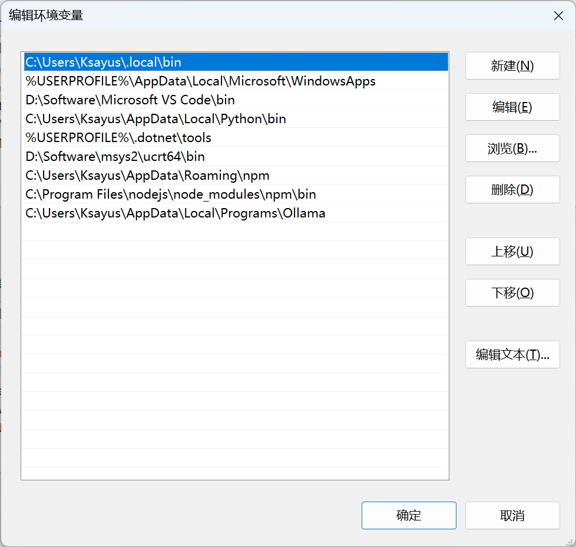

## 前言

对于很多刚接触 C/C++ 的开发者来说，在 Windows 上配置开发环境往往是第一道门槛。不同于 Linux 或 macOS 自带 GCC/Clang 工具链，Windows 需要手动安装编译器和配置环境变量。

本文将带你从零开始，一步步搭建一个完整的 C/C++ 开发环境，包含：

- **MSYS2**：提供类 Unix 的 shell 环境和包管理器
- **GCC**：C/C++ 编译器（通过 MSYS2 的 pacman 安装）
- **VSCode**：轻量级且功能强大的代码编辑器
- **系统环境变量**：让编译器在任意终端中都能使用

> [!NOTE]
> 本文适用于 Windows 10/11 64 位系统。安装过程需要稳定的网络连接，因为 MSYS2 和 GCC 的安装包体积较大。

---

## 第一步：安装 MSYS2

MSYS2 是 Windows 上的一个软件发行版和构建平台，它提供了类 Unix 的 shell 环境（bash）、包管理器（pacman），以及一套完整的编译工具链。

### 下载 MSYS2

前往 [MSYS2 官网](https://www.msys2.org/) 下载最新版的安装程序 `msys2-x86_64-*.exe`。

### 安装 MSYS2

运行下载好的安装程序，建议安装到默认路径 `C:\msys64`。

> [!TIP]
> 不建议安装到包含**空格**或**中文**的路径中，这可能导致后续编译时出现莫名其妙的问题。

安装完成后，MSYS2 会在开始菜单中创建以下几个终端快捷方式：

| 终端 | 目标架构 | 用途 |
|------|----------|------|
| MSYS2 UCRT64 | UCRT64 | **推荐使用**，使用现代 UCRT 运行时 |
| MSYS2 MINGW64 | MINGW64 | 使用较旧的 MSVCRT 运行时 |
| MSYS2 CLANG64 | CLANG64 | 使用 Clang/LLVM 工具链 |
| MSYS2 MSYS | MSYS | MSYS2 内部环境，一般用于包管理 |

> [!WARNING]
> 日常开发请使用 **UCRT64** 终端，不要混用不同终端。不同终端的环境变量和工具链是隔离的，混用会导致找不到命令或链接错误。

### 验证安装

打开 **MSYS2 UCRT64** 终端，输入以下命令检查 pacman 包管理器是否正常工作：

```bash
pacman --version
```

如果看到版本信息，说明 MSYS2 安装成功。

---

## 第二步：安装 GCC 工具链

GCC（GNU Compiler Collection）是 C/C++ 开发中最常用的编译器之一。我们通过 MSYS2 的 pacman 包管理器来安装它。

### 更新包数据库

在 UCRT64 终端中，先更新包数据库：

```bash
pacman -Syu
```

这一步可能需要运行多次，如果提示关闭终端，请关闭后重新打开 UCRT64 终端，再次运行 `pacman -Syu` 直到提示「没有可用的更新」。

### 安装 GCC

```bash
pacman -S --noconfirm mingw-w64-ucrt-x86_64-gcc
```

这条命令会安装：
- **gcc**：C 语言编译器
- **g++**：C++ 编译器
- **gdb**：调试器
- 以及相关的头文件、库文件和构建工具

> [!NOTE]
> 安装过程中如果遇到文件锁定错误（`db.lck`），说明有另一个 pacman 进程在运行。关闭所有 MSYS2 终端，删除 `C:\msys64\var\lib\pacman\db.lck` 文件后重试。

### 验证 GCC

安装完成后，在 UCRT64 终端中验证：

```bash
gcc --version
g++ --version
gdb --version
```

如果都能正确显示版本信息，说明 GCC 工具链安装成功。

---

## 第三步：配置系统环境变量

GCC 安装在 MSYS2 的目录下，目前只能在 UCRT64 终端中使用。为了让 GCC 在 Windows 原生命令行（cmd、PowerShell）以及 VSCode 中也能直接使用，我们需要将 GCC 的路径添加到系统环境变量 `PATH` 中。

### 打开系统环境变量设置

**方法一：通过搜索**

在 Windows 搜索框中输入「环境变量」，点击搜索结果中的「编辑系统环境变量」：



在弹出的「系统属性」窗口中，点击右下角的「环境变量(N)...」按钮：


点击「环境变量(N)...」后会弹出「环境变量」窗口，上半部分是**用户变量**（只对当前用户生效），下半部分是**系统变量**（对所有用户生效）：



**方法二：通过设置**

右键「此电脑」→「属性」→「高级系统设置」→「环境变量」。

### 添加 PATH 变量

> [!TIP]
> 建议添加到**系统变量**中，这样所有用户都能使用。如果你只有当前用户需要开发，也可以添加到**用户变量**中。

在「系统变量」区域找到 `Path` 变量，选中后点击「编辑」：



### 添加 MSYS2 工具链路径

在编辑窗口中，点击「新建」，依次添加以下两个路径：

```
C:\msys64\ucrt64\bin
C:\msys64\usr\bin
```

- `C:\msys64\ucrt64\bin`：GCC 编译器和相关工具所在目录
- `C:\msys64\usr\bin`：MSYS2 核心工具（如 bash、make、pacman 等）所在目录



添加完成后，使用「上移」按钮将这两个路径调整到合适的位置，确保它们**不会被其他同名命令覆盖**。



> [!WARNING]
> 如果你还安装了其他包含 `gcc.exe` 的软件（如 Dev-C++、Code::Blocks、Qt），请确保 MSYS2 的路径排在它们**前面**，否则调用到的可能是旧版本的编译器。

### 生效环境变量

点击「确定」关闭所有窗口后，**重新打开一个 cmd 或 PowerShell 窗口**，输入：

```powershell
gcc --version
```

如果显示 GCC 版本信息，说明环境变量配置成功！现在你可以在任意终端中使用 GCC 了。

---

## 第四步：安装 VSCode

VSCode（Visual Studio Code）是微软开发的一款免费、开源的代码编辑器，拥有丰富的插件生态，是 C/C++ 开发的首选编辑器之一。

### 下载 VSCode

前往 [VSCode 官网](https://code.visualstudio.com/) 下载安装程序 `VSCodeUserSetup-x64-*.exe`。

### 安装 VSCode

运行安装程序，建议勾选以下选项：

- 「将 "通过 Code 打开" 操作添加到 Windows 资源管理器文件上下文菜单」
- 「将 "通过 Code 打开" 操作添加到 Windows 资源管理器目录上下文菜单」
- 「将 Code 注册为受支持的文件类型的编辑器」
- 「添加到 PATH」（很重要，这样可以在终端中直接输入 `code .` 打开 VSCode）

### 安装 C/C++ 扩展

打开 VSCode，点击左侧活动栏的「扩展」图标（或按 `Ctrl+Shift+X`），搜索并安装以下扩展：

| 扩展名称 | 用途 |
|----------|------|
| **C/C++** (Microsoft) | 提供 IntelliSense、调试、代码浏览等核心功能 |
| **C/C++ Extension Pack** (Microsoft) | 一键安装 C/C++ 开发所需的推荐扩展集合 |

> [!TIP]
> 建议直接安装 **C/C++ Extension Pack**，它包含了 C/C++ 扩展、CMake 工具、调试器扩展等常用插件。

---

## 第五步：验证完整环境

现在让我们写一个简单的 C++ 程序来验证整个环境是否配置正确。

### 创建测试项目

在任意目录下创建一个文件 `hello.cpp`：

```cpp
#include <iostream>

int main() {
    std::cout << "Hello, C/C++ World!" << std::endl;
    return 0;
}
```

### 命令行编译运行

打开 cmd 或 PowerShell，进入文件所在目录，执行：

```powershell
g++ hello.cpp -o hello.exe
.\hello.exe
```

如果输出 `Hello, C/C++ World!`，说明环境配置完全正确！

### 在 VSCode 中使用

在文件所在目录打开 VSCode：

```powershell
code .
```

在 VSCode 中打开 `hello.cpp`，按 `Ctrl+Shift+B` 选择 `g++.exe build active file`，然后按 `F5` 运行调试，应该能正常编译和运行。

> [!NOTE]
> 如果 VSCode 提示找不到 `g++`，请检查：
> 1. 环境变量是否正确添加
> 2. 是否**重新打开**了 VSCode（环境变量修改后需要重启应用程序才能生效）

---

## 总结

恭喜你！现在你已经拥有了一套完整的 C/C++ 开发环境：

| 组件 | 作用 |
|------|------|
| **MSYS2** | 提供 Unix 工具链和包管理器 |
| **GCC (UCRT64)** | C/C++ 编译器、调试器 |
| **VSCode + C/C++ 扩展** | 代码编辑、智能提示、调试 |
| **系统 PATH 环境变量** | 让编译器在任意终端可用 |

整个流程可以总结为以下四步：

```
安装 MSYS2 → 安装 GCC → 配置 PATH 环境变量 → 安装 VSCode
```

现在你可以开始编写和编译 C/C++ 程序了。如果你需要图形界面开发，后续还可以安装 Qt、SDL2、SFML 等库，它们同样可以通过 MSYS2 的 pacman 方便地安装。

> [!TIP]
> 后续开发中如果遇到缺少库的情况，可以在 UCRT64 终端中使用 `pacman -Ss <关键词>` 搜索可用的包，然后用 `pacman -S <包名>` 安装。MSYS2 的软件仓库非常丰富，几乎涵盖了所有常用的 C/C++ 开发库。