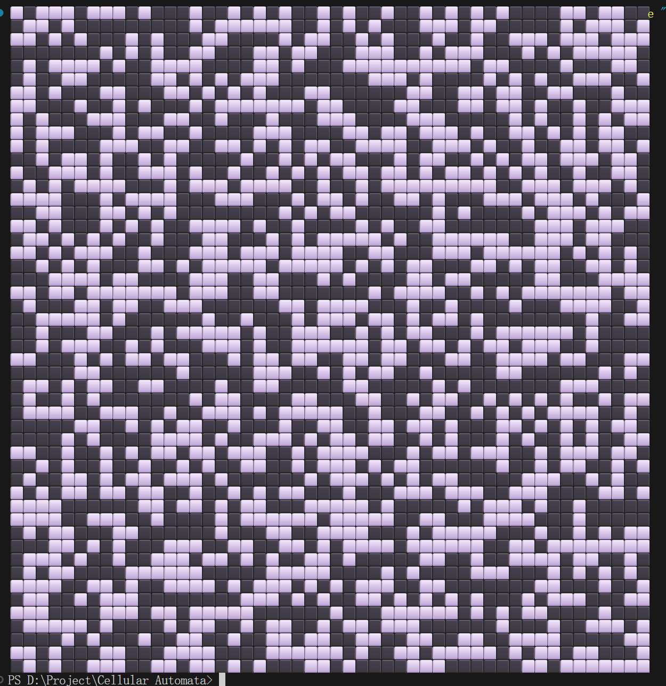
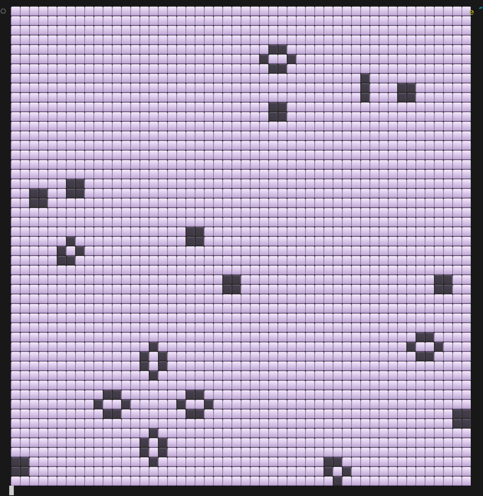

## 什么是康威生命游戏

**康威生命游戏（Conway's Game of Life）** 是英国数学家约翰·康威于 1970 年提出的**零玩家游戏**。它不需要玩家操作，只需要设定初始状态，游戏就会按照固定规则自动演化。

> [!NOTE]
> 生命游戏是**元胞自动机（Cellular Automaton）** 最著名的例子。它证明了：极其简单的规则可以产生极其复杂的行为——甚至具备图灵完备性。

生命游戏在一个二维网格上进行，每个格子代表一个「细胞」，它只有两种状态：

- **存活（Alive）**：细胞活着
- **死亡（Dead）**：细胞死亡

每一代，所有细胞根据周围八个邻居的状态，按照以下规则同步更新：

| 当前状态 | 条件 | 下一状态 |
|----------|------|----------|
| 存活 | 周围存活邻居 < 2（孤独） | 死亡 |
| 存活 | 周围存活邻居 = 2 或 3 | 存活 |
| 存活 | 周围存活邻居 > 3（拥挤） | 死亡 |
| 死亡 | 周围存活邻居 = 3（繁殖） | 存活 |
| 死亡 | 其他情况 | 死亡 |

> [!TIP]
> 这四条规则通常简记为 **B3/S23**：Birth 需要 3 个邻居，Survive 需要 2 或 3 个邻居。

## 完整代码实现

```python
import random
from time import sleep


class Map:
    def __init__(self, x: int = 10, y: int = 10):
        self.seed = random.randint(0, 10**8)
        self.x = x
        self.y = y
        self.map = [[0 for i in range(x)] for j in range(y)]
        self.next_map = [[0 for i in range(x)] for j in range(y)]
        self.color_map = [["" for i in range(x)] for j in range(y)]

        random.seed(self.seed)

    def Generate(self, probability: float = 0.5):
        for y in range(self.y):
            for x in range(self.x):
                self.map[y][x] = 1 if random.random() < probability else 0

    def SideExamine(self, xy: tuple):
        row, col = xy[0], xy[1]
        return 0 <= row < self.y and 0 <= col < self.x

    def SetStatus(self, xy: tuple, status: str):
        x_in, y_in = xy[0], xy[1]
        if not self.SideExamine(xy): return
        match status:
            case "die":
                self.next_map[x_in][y_in] = 0
            case "alive":
                self.next_map[x_in][y_in] = 1

    def DirectionExamine(self, xy: tuple):
        x_in, y_in = xy[0], xy[1]
        final_count = 0

        direction_delta = [
            [0, -1],
            [0, 1],
            [-1, 0],
            [1, 0],
            [-1, -1],
            [-1, 1],
            [1, -1],
            [1, 1]
        ]

        for dr, dc in direction_delta:
            nr, nc = x_in + dr, y_in + dc
            if 0 <= nr < self.y and 0 <= nc < self.x:
                final_count += self.map[nr][nc]

        return final_count

    def Examine(self, xy: tuple):
        x_in, y_in = xy[0], xy[1]
        if not self.SideExamine(xy): return

        now_status = 0
        if self.map[x_in][y_in] == 1 : now_status = 1
        final_count = self.DirectionExamine(xy)

        if now_status:
            if final_count < 2 or final_count > 3:
                self.SetStatus(xy, "die")
            if final_count == 2 or final_count == 3:
                self.SetStatus(xy, "alive")
        else:
            if final_count == 3:
                self.SetStatus(xy, "alive")

    def Run(self, step: int):
        if step == 0: return
        if step < 0: step = 10000

        for i in range(step):
            self.next_map = [row[:] for row in self.map]
            for y in range(self.y):
                for x in range(self.x):
                    self.Examine((y, x))
            self.map = self.next_map
            self.Show()

    def GenerateColorMap(self):
        for y in range(self.y):
            for x in range(self.x):
                self.color_map[y][x] = "⬜" if self.map[y][x] != 1 else "⬛️"

    def Show(self):
        print("\033[H", end="")
        self.GenerateColorMap()
        for y in range(self.y):
            for x in range(self.x):
                print(self.color_map[y][x], end="")
            print()
        sleep(0.1)

if __name__ == "__main__":
    m = Map(x=50, y=50)
    m.Generate(0.5)
    m.Show()
    m.Run(step=-1)
```

## 核心类详解

### Map 初始化

```python
class Map:
    def __init__(self, x: int = 10, y: int = 10):
        self.seed = random.randint(0, 10**8)
        self.x = x
        self.y = y
        self.map = [[0 for i in range(x)] for j in range(y)]
        self.next_map = [[0 for i in range(x)] for j in range(y)]
        self.color_map = [["" for i in range(x)] for j in range(y)]
```

`Map` 类维护了三个二维数组：

- **`map`**：当前这一代的细胞状态（0 = 死亡，1 = 存活）
- **`next_map`**：下一代的细胞状态，用于双缓冲更新
- **`color_map`**：用于终端渲染的字符映射（⬜ / ⬛️）

> [!TIP]
> 使用 `next_map` 作为双缓冲是必要的——所有细胞必须**同步更新**。如果原地修改 `map`，后面细胞的判断会受前面已更新细胞的影响，导致错误结果。

`self.seed` 保存了随机种子，方便复现有趣的初始状态。

### 随机生成初始状态

```python
def Generate(self, probability: float = 0.5):
    for y in range(self.y):
        for x in range(self.x):
            self.map[y][x] = 1 if random.random() < probability else 0
```

遍历每个格子，以 `probability` 的概率将其设为存活。默认 0.5 意味着大约一半的细胞初始存活。

### 边界检查

```python
def SideExamine(self, xy: tuple):
    row, col = xy[0], xy[1]
    return 0 <= row < self.y and 0 <= col < self.x
```

简单的边界检查方法，确保坐标在网格范围内。本实现使用**固定边界**（边界外的细胞视为不存在），而非循环边界。

### 邻居计数

```python
def DirectionExamine(self, xy: tuple):
    x_in, y_in = xy[0], xy[1]
    final_count = 0

    direction_delta = [
        [0, -1], [0, 1], [-1, 0], [1, 0],
        [-1, -1], [-1, 1], [1, -1], [1, 1]
    ]

    for dr, dc in direction_delta:
        nr, nc = x_in + dr, y_in + dc
        if 0 <= nr < self.y and 0 <= nc < self.x:
            final_count += self.map[nr][nc]

    return final_count
```

这是生命游戏的核心方法。`direction_delta` 定义了八个方向（上、下、左、右、四个对角线），遍历每个方向，统计存活邻居的数量。

### 演化规则

```python
def Examine(self, xy: tuple):
    x_in, y_in = xy[0], xy[1]
    if not self.SideExamine(xy): return

    now_status = 0
    if self.map[x_in][y_in] == 1 : now_status = 1
    final_count = self.DirectionExamine(xy)

    if now_status:
        if final_count < 2 or final_count > 3:
            self.SetStatus(xy, "die")
        if final_count == 2 or final_count == 3:
            self.SetStatus(xy, "alive")
    else:
        if final_count == 3:
            self.SetStatus(xy, "alive")
```

`Examine` 方法实现了 B3/S23 规则：

- **存活细胞**：邻居少于 2 个（孤独而死）或多于 3 个（拥挤而死）→ 死亡；邻居刚好 2 或 3 个 → 存活
- **死亡细胞**：邻居恰好 3 个 → 繁殖（复活）

### 运行循环

```python
def Run(self, step: int):
    if step == 0: return
    if step < 0: step = 10000

    for i in range(step):
        self.next_map = [row[:] for row in self.map]
        for y in range(self.y):
            for x in range(self.x):
                self.Examine((y, x))
        self.map = self.next_map
        self.Show()
```

每一代：

1. 将 `next_map` 初始化为当前 `map` 的副本
2. 遍历所有细胞，调用 `Examine` 计算下一状态，写入 `next_map`
3. 将 `next_map` 赋值给 `map`（换代）
4. 调用 `Show()` 渲染到终端

传入 `-1` 表示无限循环（实际限制为 10000 代）。

### 终端渲染

```python
def GenerateColorMap(self):
    for y in range(self.y):
        for x in range(self.x):
            self.color_map[y][x] = "⬜" if self.map[y][x] != 1 else "⬛️"

def Show(self):
    print("\033[H", end="")
    self.GenerateColorMap()
    for y in range(self.y):
        for x in range(self.x):
            print(self.color_map[y][x], end="")
        print()
    sleep(0.1)
```

- `\033[H` 是 ANSI 转义序列，将光标移到终端左上角，实现**原地刷新**动画效果
- 存活细胞显示为 ⬛️，死亡细胞显示为 ⬜
- `sleep(0.1)` 控制每代间隔 0.1 秒

## 运行方式

```python
if __name__ == "__main__":
    m = Map(x=50, y=50)    # 创建 50×50 的网格
    m.Generate(0.5)         # 50% 概率随机生成初始状态
    m.Show()                # 显示初始状态
    m.Run(step=-1)          # 无限运行
```

直接运行脚本即可在终端看到生命游戏的演化动画。

下图是随机初始状态（50% 存活率）以及运行若干代后趋于稳定的状态：





## 著名的生命游戏模式

在随机初始状态下，经过若干代演化，通常会形成一些稳定的模式。生命游戏中有几类经典模式：

| 类型 | 描述 | 代表 |
|------|------|------|
| **静止物体（Still Life）** | 永远不变的稳定结构 | 方块（Block）、蜂巢（Beehive） |
| **振荡器（Oscillator）** | 周期性重复的模式 | 闪光灯（Blinker）、蟾蜍（Toad） |
| **滑翔机（Glider）** | 会移动的稳定结构 | 滑翔机（Glider）、轻型飞船（LWSS） |
| **繁殖者（Breeder）** | 不断产生新物体的模式 | Gosper 滑翔机枪 |

> [!NOTE]
> 滑翔机是生命游戏中最著名的模式之一——它是一个 5 细胞的结构，每 4 代会向对角方向移动一格。正是 Gosper 滑翔机枪的发现，证明了生命游戏具备**图灵完备性**。

## 总结

康威生命游戏用不到 100 行 Python 代码实现了一个完整的元胞自动机，直观地展示了**简单规则如何涌现复杂行为**。这套代码使用双缓冲机制保证同步更新，通过 ANSI 转义序列实现流畅的终端动画，还保存了随机种子方便复现。

如果你对元胞自动机感兴趣，可以尝试以下扩展：

- 实现循环边界（Toroidal 网格）
- 添加更多颜色映射（按年龄、状态变化等）
- 支持手动点击放置初始细胞
- 尝试其他规则变体（如 HighLife 的 B36/S23）