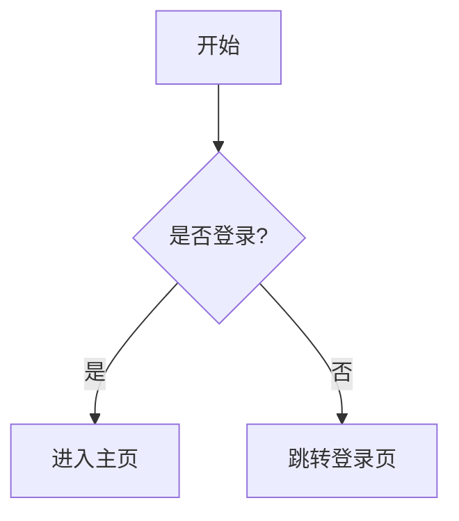
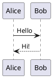

本文是 Ksayus の 猫窝 的 Markdown 编写完全指南，涵盖从基础语法到 Firefly 主题扩展功能的全部用法。无论你是 Markdown 新手还是老手，都能在这里找到实用的写法。

## 目录

- [文章结构](#文章结构)
- [基础语法](#基础语法)
  - [标题](#标题)
  - [段落与换行](#段落与换行)
  - [文本样式](#文本样式)
  - [列表](#列表)
  - [引用](#引用)
  - [链接](#链接)
  - [图片](#图片)
  - [代码](#代码)
  - [表格](#表格)
  - [分割线](#分割线)
- [Firefly 扩展语法](#firefly-扩展语法)
  - [提醒块 Callouts](#提醒块-callouts)
  - [GitHub 仓库卡片](#github-仓库卡片)
  - [增强代码块](#增强代码块)
  - [图片网格](#图片网格)
  - [剧透文本](#剧透文本)
  - [Wiki 内部链接](#wiki-内部链接)
  - [Mermaid 图表](#mermaid-图表)
  - [PlantUML 图表](#plantuml-图表)
  - [KaTeX 数学公式](#katex-数学公式)

---

## 文章结构

每篇文章由 **Frontmatter**（元数据）和 **正文** 两部分组成。Frontmatter 位于文件顶部，用 `---` 包裹：

```yaml
---
title: 文章标题
published: 2024-01-01
description: 文章摘要，用于 SEO 和列表预览
image: ./cover.jpg
tags: [标签1, 标签2]
category: 分类名
draft: false
pinned: false
comment: true
---
```

### 常用字段说明

| 字段 | 必填 | 说明 |
|------|------|------|
| `title` | ✅ | 文章标题 |
| `published` | ✅ | 发布日期，格式 `YYYY-MM-DD` |
| `description` | 推荐 | 文章摘要，显示在列表和 SEO 中 |
| `image` | 可选 | 封面图，支持相对路径、`/` 开头的 public 路径或远程 URL |
| `tags` | 可选 | 标签数组 |
| `category` | 可选 | 分类 |
| `draft` | 可选 | `true` 时为草稿，不会发布 |
| `pinned` | 可选 | `true` 时置顶 |
| `comment` | 可选 | 是否允许评论，默认 `true` |
| `slug` | 可选 | 自定义 URL 路径 |
| `series` | 可选 | 系列名称，同系列文章会自动关联 |

> [!TIP]
> 使用 `pnpm new-post 文章名` 命令可以快速创建带模板的文章文件。

---

## 基础语法

### 标题

使用 `#` 表示标题，1~6 个 `#` 对应 h1~h6：

```markdown
# 一级标题
## 二级标题
### 三级标题
#### 四级标题
##### 五级标题
###### 六级标题
```

> [!NOTE]
> 文章正文建议从 `##` 开始，因为 `#` 一级标题已由文章标题占用。

### 段落与换行

段落之间用**空行**分隔。行尾加**两个空格**实现强制换行：

```markdown
这是第一段。

这是第二段。

行尾两个空格  
实现换行。
```

### 文本样式

```markdown
**粗体**
*斜体*
***粗斜体***
~~删除线~~
`行内代码`
```

**粗体** · *斜体* · ***粗斜体*** · ~~删除线~~ · `行内代码`

### 列表

**无序列表**：使用 `-`、`*` 或 `+`

```markdown
- 项目一
- 项目二
  - 嵌套项目
  - 嵌套项目二
```

**有序列表**：使用数字加 `.`

```markdown
1. 第一步
2. 第二步
3. 第三步
```

**任务列表**：

```markdown
- [x] 已完成的任务
- [ ] 未完成的任务
- [ ] 另一个任务
```

### 引用

使用 `>` 表示引用，支持嵌套：

```markdown
> 这是一段引用。
>
> > 这是嵌套引用。
```

> 这是一段引用。
>
> > 这是嵌套引用。

### 链接

```markdown
[显示文本](https://example.com)
[带标题的链接](https://example.com "鼠标悬停提示")
<https://example.com>
```

### 图片

```markdown


```

图片路径支持三种格式：
- `./images/xxx.jpg` — 相对文章文件的路径
- `/assets/images/xxx.jpg` — public 目录下的绝对路径
- `https://...` — 远程 URL

### 代码

**行内代码**：用反引号包裹

```markdown
使用 `console.log()` 输出信息
```

**代码块**：用三个反引号包裹，可指定语言

````markdown
```javascript
function hello() {
  console.log("Hello, World!");
}
```
````

### 表格

```markdown
| 左对齐 | 居中 | 右对齐 |
|:------|:----:|------:|
| 内容1 | 内容2 | 内容3 |
| 内容4 | 内容5 | 内容6 |
```

| 左对齐 | 居中 | 右对齐 |
|:------|:----:|------:|
| 内容1 | 内容2 | 内容3 |
| 内容4 | 内容5 | 内容6 |

### 分割线

```markdown
---
***
___
```

---

## Firefly 扩展语法

### 提醒块 Callouts

Firefly 支持四种风格的提醒块，可在 `siteConfig.ts` 中切换主题。本站使用 **GitHub 风格**，语法如下：

```markdown
> [!NOTE]
> 提示信息，用户应该注意的内容。

> [!TIP]
> 实用技巧或建议。

> [!IMPORTANT]
> 关键信息，必须了解的内容。

> [!WARNING]
> 警告，需要立即注意。

> [!CAUTION]
> 注意，可能产生负面后果。
```

> [!NOTE]
> 提示信息，用户应该注意的内容。

> [!TIP]
> 实用技巧或建议。

> [!IMPORTANT]
> 关键信息，必须了解的内容。

> [!WARNING]
> 警告，需要立即注意。

> [!CAUTION]
> 注意，可能产生负面后果。

也支持**自定义标题**：

```markdown
> [!NOTE] 自定义标题
> 这是一个带有自定义标题的提示框。
```

> [!NOTE] 自定义标题
> 这是一个带有自定义标题的提示框。

### GitHub 仓库卡片

一行代码即可展示 GitHub 仓库信息卡片：

```markdown
::github{repo="CuteLeaf/Firefly"}
```

::github{repo="CuteLeaf/Firefly"}

### 增强代码块

本站基于 [Expressive Code](https://expressive-code.com/) 提供强大的代码块增强功能。

#### 语法高亮与语言标识

````markdown
```typescript
const message: string = "Hello, TypeScript!";
console.log(message);
```
````

#### 标题与框架

为代码块添加文件名标题，自动渲染为编辑器样式：

````markdown
```js title="hello.js"
console.log("带标题的代码块");
```
````

终端命令自动渲染为终端样式：

````markdown
```bash
pnpm install
pnpm dev
```
````

#### 行标记

高亮特定行或行范围：

````markdown
```js {1, 3-4}
const a = 1;      // 高亮
const b = 2;
const c = a + b;  // 高亮
console.log(c);   // 高亮
```
````

#### 行号

````markdown
```js showLineNumbers
console.log("显示行号");
console.log("第2行");
```
````

也可自定义起始行号：`showLineNumbers startLineNumber=10`

#### 可折叠代码

长代码可以折叠部分行：

````markdown
```js collapse={1-4}
// 这些行会被折叠
import { foo } from "bar";
import { baz } from "qux";

// 这行可见
console.log("Hello");
```
````

#### Tab 代码组

多个代码块合并为标签页：

````markdown
::: code-group labels=[JavaScript, Python]

```js
console.log("Hello");
```

```py
print("Hello")
```

:::
````

### 图片网格

使用 `[grid]` 标签将多张图片并排展示，自动响应式布局：

```markdown
[grid]


[/grid]
```

[grid]


[/grid]

> [!NOTE]
> 同一排中高度不同的图片会自动裁剪对齐，点击可查看原图。

### 剧透文本

使用 `:spoiler[]` 包裹需要隐藏的内容：

```markdown
这是剧透：:spoiler[真相只有一个！]
```

这是剧透：:spoiler[真相只有一个！]

### Wiki 内部链接

支持 Obsidian 风格的 `[[ ]]` 内部链接，链接到本站其他文章。

**文章卡片**（单独成段时渲染为卡片）：

```markdown
[[markdown-extended]]
```

**行内链接**：

```markdown
请参阅 [[markdown-extended|Markdown 扩展功能]] 了解更多。
```

链接目标支持三种写法：
- `[[slug]]` — 文章的 slug
- `[[guide/firefly-wiki-link]]` — 文件相对路径
- `[[firefly-wiki-link]]` — 裸文件名（唯一时）

### Mermaid 图表

在代码块中使用 `mermaid` 语言绘制流程图、时序图等：

````markdown

````


### PlantUML 图表

使用 `plantuml` 语言绘制 UML 图：

````markdown

````

### KaTeX 数学公式

**行内公式**：用 `$` 包裹

```markdown
质能方程 $E = mc^2$ 是物理学的基础。
```

**块级公式**：用 `$$` 包裹

```markdown
$$
\int_{-\infty}^{\infty} e^{-x^2} dx = \sqrt{\pi}
$$
```

$$
\int_{-\infty}^{\infty} e^{-x^2} dx = \sqrt{\pi}
$$

---

## 写在最后

以上就是本站支持的全部 Markdown 语法。建议结合 [Markdown 扩展功能](/posts/markdown-extended/) 和 [代码块示例](/posts/code-examples/) 两篇文章一起阅读，获得更完整的示例。

祝写作愉快！🐱